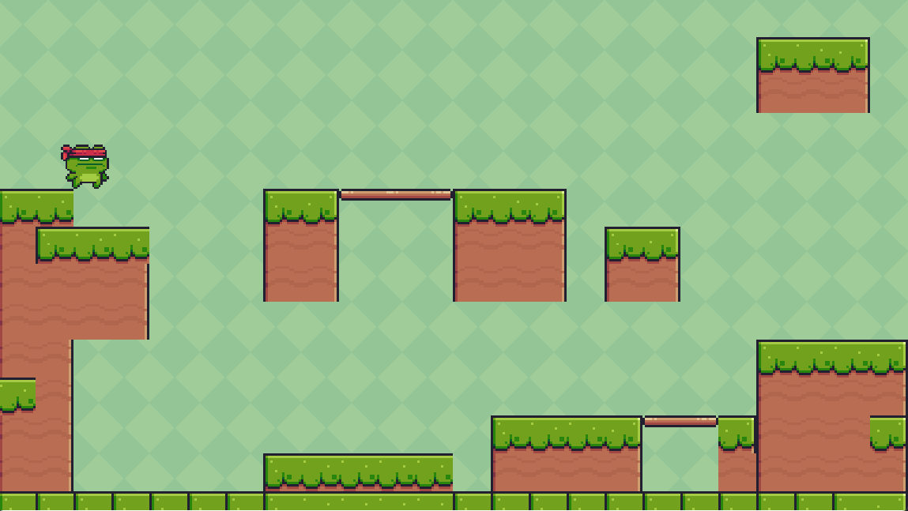
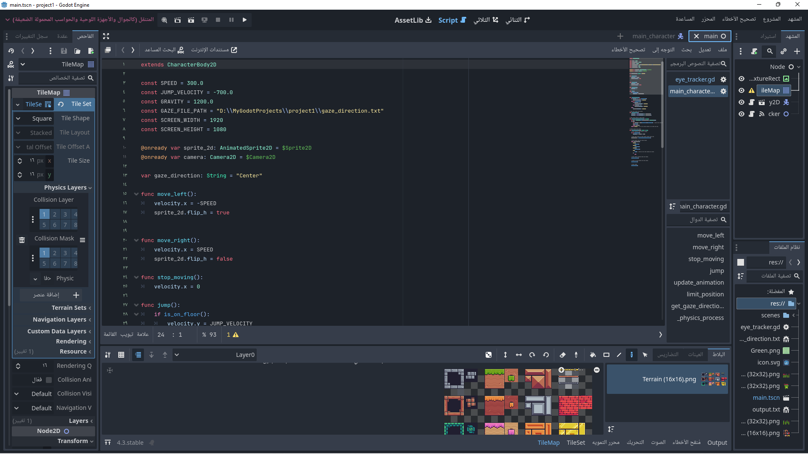

# Eye-Controlled-Game
A Godot Engine game using eye-tracking  with OpenCV.

Developed an innovative game application using the Godot Engine, enabling gameplay through eye-tracking technology.   Designed 
and implemented features to enhance accessibility and provide an immersive gaming experience 

